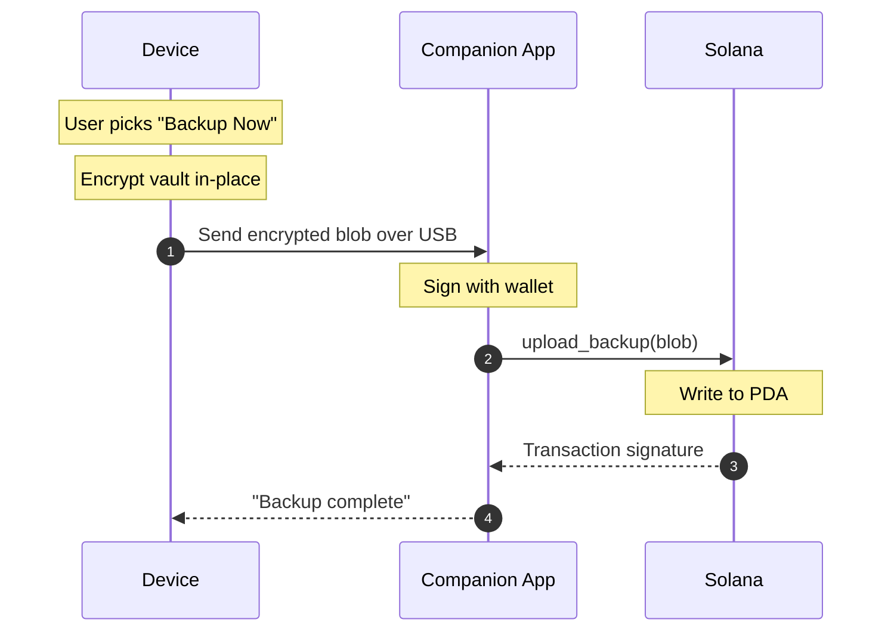
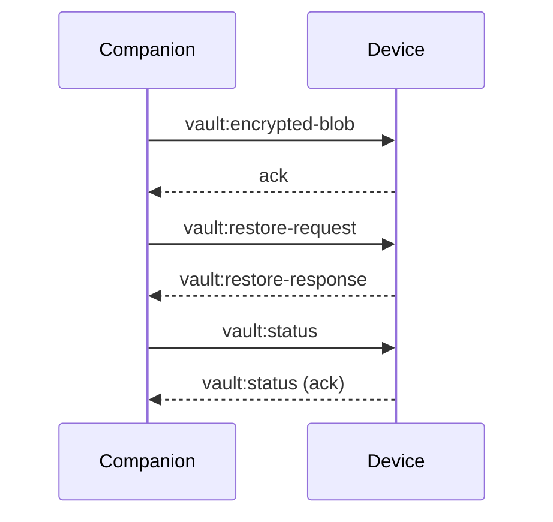

# Black Seal

> An offline hardware vault for passwords, seed phrases, secret notes, and the digital legacy you leave behind.

Black Seal is a hardware device that holds your secrets the way a Ledger holds your crypto keys - locked inside a tamper-resistant chip, never on a server, never on the internet, never readable by anyone who hasn't held the device and entered the PIN. This repository is the public, browser-based simulation of that device, built for the Colosseum Frontier Hackathon (April 6 – May 11, 2026).

The simulation runs the same cryptography (AES-256-GCM, BIP-39, PBKDF2-HMAC-SHA512), exposes the same five-button OLED interface, and talks to the same Anchor program deployed on Solana devnet. Nothing is mocked. The point of the simulation is not to fake the device - it is to prove that the device's design works end-to-end before any silicon is ordered.

---

## Table of Contents

- [What Black Seal Is](#what-black-seal-is)
- [Why It Exists](#why-it-exists)
- [The Hardware Vault - How It Should Work](#the-hardware-vault---how-it-should-work)
  - [The Device](#the-device)
  - [The Cryptographic Pipeline](#the-cryptographic-pipeline)
  - [The State Machine](#the-state-machine)
  - [PIN, Lock, Wipe](#pin-lock-wipe)
  - [Optional Cloud Backup on Solana](#optional-cloud-backup-on-solana)
  - [Security Model](#security-model)
  - [Bill of Materials](#bill-of-materials)
- [The Simulation - How It Actually Works](#the-simulation---how-it-actually-works)
  - [Three Systems, One Product](#three-systems-one-product)
  - [The Device Simulator](#the-device-simulator)
  - [The Companion App](#the-companion-app)
  - [The Anchor Program](#the-anchor-program)
  - [How the Tabs Talk to Each Other](#how-the-tabs-talk-to-each-other)
  - [Real Cryptography, No Mocks](#real-cryptography-no-mocks)
- [Project Structure](#project-structure)
- [Quick Start](#quick-start)
- [Tech Stack](#tech-stack)
- [Roadmap - Simulation to Silicon](#roadmap---simulation-to-silicon)
- [Credits](#credits)

---

## What Black Seal Is

Black Seal is two things at once:

1. **A physical device.** A pocket-sized, air-gapped vault with an OLED screen, five buttons, a USB-C port, and a secure element. No Wi-Fi, no Bluetooth, no radio of any kind. It generates a 24-word BIP-39 seed on first boot, derives a private key inside a tamper-resistant chip, and encrypts everything you save with AES-256-GCM. Three wrong PINs and it wipes itself. Two minutes idle and it locks. The data lives on the device and nowhere else - unless you opt in to encrypted backup on Solana.

2. **This simulation.** A browser-based reproduction of the device that runs the same crypto, the same state machine, and the same backup protocol against the real Anchor program on Solana devnet. Open the simulator, generate a seed, set a PIN, store a password, back it up to the chain, wipe the device, restore it from the seed phrase on the same chain. Every step is real. The "USB cable" between the device tab and the companion tab is a `BroadcastChannel` - the data crossing it is encrypted with the same primitives the real device will use.

The simulation exists so that the design can be proven, reviewed, and demonstrated long before the hardware ships. The roadmap section at the end explains what gets built next.

---

## Why It Exists

A password manager that lives on the internet is a password manager that gets breached. LastPass demonstrated this. So did every other cloud vault that has been compromised in the last decade. The model is broken at the architecture layer - your secrets sit on someone else's server, encrypted with a key derived from a password you typed into a website that an AI agent with email access can phish out of you next week.

Hardware wallets fixed this for crypto. Ledger and Trezor took the private key off the internet and put it inside a chip that physically cannot be read. The result: billions of dollars in private keys, zero remote breaches of the keys themselves.

Black Seal extends that exact model - air-gapped device, secure element, seed-phrase recovery - to the rest of your digital life. Passwords, recovery codes, API keys, seed phrases for other wallets, secret notes, the legacy instructions you want your family to read when you are gone. All of it encrypted on a device that has no network stack, no browser, no app store, and no way for an AI agent to reach it.

The pitch is not "another password manager." The pitch is **air-gapped sovereignty for the part of your life that currently sits on someone else's cloud.**

---

## The Hardware Vault - How It Should Work

### The Device

A compact, card-sized hardware vault. Five buttons (Up, Down, Left, Right, Confirm). A small OLED screen rendering green monospace text on black, 21 characters per line, 8 lines high. A USB-C port for charging and for the encrypted backup link. A LiPo battery good for months of standby. An aluminium or ABS shell that shows visible damage if anyone tries to pry it open.

Inside the shell:

| Block            | Part                | Role                                                                 |
| ---------------- | ------------------- | -------------------------------------------------------------------- |
| MCU              | STM32L432KC         | Cortex-M4, runs all firmware logic at 80MHz                          |
| Secure element   | ATECC608B           | Holds the private key, signs payloads, key never leaves the chip     |
| Display          | SSD1306 OLED 128×64 | Renders the entire UI                                                |
| Flash            | W25Q128JV (16MB)    | Encrypted vault storage                                              |
| USB bridge       | CP2102N             | UART ↔ USB-C for the companion app link                              |
| Power            | MCP73831 + 400mAh   | LiPo charge and run                                                  |

The MCU does the navigation, the screen, the keyboard scanning, the AES encryption (using STM32's hardware AES engine), and the USB protocol. The secure element does one thing: hold the private key derived from the seed and sign payloads with it. The MCU never sees the private key. That separation is the whole point.

There is no Wi-Fi, no Bluetooth, no NFC. There is no general-purpose OS. The firmware is bare-metal or FreeRTOS, signed and verified at boot, with a custom USB device class that refuses to enumerate as a storage drive.

### The Cryptographic Pipeline

```text
24-word BIP-39 seed phrase   (256 bits of entropy, English wordlist)
           │
           ▼
PBKDF2-HMAC-SHA512           (100,000 iterations, device-local salt)
           │
           ▼
32-byte master key           (lives in RAM only, zeroed on lock)
           │
           ├──►  AES-256-GCM key  ──►  encrypts every byte written to flash
           │
           └──►  Ed25519 keypair  ──►  addresses the Solana PDA
                                       (only if backup is enabled)
```

Every value that hits flash is encrypted before it gets there. The master key is rebuilt from the seed every time you unlock with your PIN, then wiped from memory the moment the device locks. The seed phrase itself is never stored after the verification step at setup - paper backup is the only place it exists outside your head.

The Ed25519 keypair is derived deterministically from the same seed. That determinism is what makes restore work: the same seed always derives the same public key, which always addresses the same PDA on Solana, which always holds the latest encrypted backup. No server lookup, no account, no email - the seed phrase is the identity.

### The State Machine

```text
BOOT_SCREEN
└── FIRST_TIME_SETUP
    ├── GENERATE_SEED        (24 words shown one at a time)
    ├── VERIFY_SEED          (user re-enters 3 random words to confirm)
    ├── SET_PIN              (8 digits, button-driven entry)
    ├── BACKUP_CHOICE        ([ Enable backup ]  [ Local only ])
    └── SETUP_COMPLETE
        └── MAIN_MENU
            ├── PASSWORDS
            │   ├── LIST
            │   ├── ENTRY    (reveals for 10s, then auto-hides)
            │   └── ADD_NEW
            ├── NOTES
            │   ├── LIST
            │   ├── VIEW     (scrollable)
            │   └── ADD_NEW
            └── SETTINGS
                ├── BACKUP NOW       (if enabled)
                ├── CHANGE PIN
                ├── ENABLE BACKUP    (if not yet enabled)
                └── WIPE DEVICE
```

Every screen is owned by the firmware FSM. There is no "type into a box" - character entry is a button-driven picker, the same way Ledger does it. This is slow on purpose: it raises the cost of shoulder-surfing and removes the entire class of clipboard, keylogger, and autofill attacks.

### PIN, Lock, Wipe

Three lines, three guarantees.

- **PIN.** Eight digits. 100 million combinations. Entered through Up/Down to change the digit, Right to advance, Confirm to commit. The PIN is verified inside the secure element - the comparison never happens in main RAM.
- **Auto-lock.** Two minutes of inactivity and the device locks. The master key is zeroed. To get back in you re-enter the PIN, which re-derives the master key from the seed-derived secret inside the secure element.
- **3-strike wipe.** Three consecutive wrong PINs and the firmware overwrites flash with zeros, then random data, then zeros again, and resets to the factory boot screen. A thief gets a blank device. The owner who forgot their PIN gets to restart from the paper seed phrase.

There is no backdoor, no support hotline, no "reset link." The seed phrase is the only path back in.

### Optional Cloud Backup on Solana

Backup is **opt-in** and **chain-native.** During setup the user picks one of two paths:

**Local only.** No Solana account, no wallet, no companion app needed. Vault data lives only in encrypted flash on the device. Wipe the device or lose it and the data is gone. The seed phrase still re-derives the key on a new device - but with nothing to decrypt, that key is useless.

**Backup enabled.** The seed-derived Ed25519 public key addresses a Program Derived Address (PDA) on Solana with seeds `["black_seal_vault", owner_pubkey]`. The companion app talks to this PDA on the user's behalf. The PDA stores:

| Field            | Purpose                                       |
| ---------------- | --------------------------------------------- |
| `owner`          | The public key authorised to write the vault  |
| `version`        | Monotonic counter - incremented on each push  |
| `last_updated`   | Unix timestamp of the most recent backup      |
| `data_size`      | Size of the encrypted blob in bytes           |
| `encrypted_data` | Up to 8 KiB AES-256-GCM ciphertext            |
| `bump`           | PDA bump seed                                 |

The Anchor program exposes four instructions:

```text
initialize_vault  →  creates the PDA the first time backup is turned on
upload_backup     →  overwrites encrypted_data, bumps version, stamps the time
fetch_backup      →  reads the encrypted blob back (read-only)
delete_vault      →  closes the PDA, returns rent to the owner
```

The blob on chain is opaque ciphertext. Every byte of it was encrypted on-device under a key derived from the user's seed phrase. A complete compromise of Solana RPC, Helius, the Anchor program account, or any indexer would yield bytes that no one - including Black Seal - can decrypt. Without the seed phrase there is no decryption path. The on-chain footprint is just the storage layer.

The backup flow over USB (in production, BroadcastChannel in the simulation):



Restore is the same flow in reverse - companion fetches the blob from the PDA, hands it back to the device, device decrypts it with the freshly-derived key, vault is back. No account, no email, no recovery questions. The seed phrase is the recovery.

### Security Model

| Threat                                 | Mitigation                                                                        |
| -------------------------------------- | --------------------------------------------------------------------------------- |
| Device theft                           | 3-strike PIN wipe + 8-digit PIN → 100M combinations, irrecoverable on third miss  |
| Device loss                            | Seed phrase + (optional) on-chain backup restores onto any new device             |
| Cloud / RPC breach                     | On-chain data is AES-256-GCM ciphertext. Key never touches the wire               |
| Companion app compromise               | App only handles ciphertext. No plaintext, no key access, no signing material     |
| AI-powered credential harvesting       | Device has no network stack. No email, no API, no surface to reach                |
| Shoulder-surfing PIN entry             | 8 digits, button-driven entry that does not display the running digit by default  |
| USB MITM during backup                 | Payload is already AES-256-GCM ciphertext before it hits the cable                |
| Seed phrase theft                      | User's responsibility - bank vault, fire safe, Shamir split in a future revision  |
| Firmware tampering                     | Secure boot chain, signed firmware, unsigned firmware does not execute            |
| Physical key extraction                | Private key lives in ATECC608B. Tamper-resistant, certified, no software readout  |

### Bill of Materials

At production volume (post-prototype) the device is engineered for a sub-$25 BOM:

| Component     | Part              | Unit cost (volume) |
| ------------- | ----------------- | ------------------ |
| Secure element| ATECC608B         | $1.50              |
| MCU           | STM32L432KC       | $4.00              |
| OLED display  | SSD1306 128×64    | $2.00              |
| Flash         | W25Q128JV (16MB)  | $1.00              |
| USB bridge    | CP2102N           | $0.80              |
| Power         | MCP73831 + LiPo   | $3.00              |
| Enclosure     | Aluminium / ABS   | $8.00              |
| Misc passives | -                 | $2.00              |
| **Total**     |                   | **~$22**           |

Target retail: $79–129 one-time. No subscription. One-time Solana transaction (~$0.001 in SOL) to initialise the backup PDA. The economics work because the storage layer is a public chain and the company does not run servers.

---

## The Simulation - How It Actually Works

### Three Systems, One Product

The simulation is faithful to the production architecture. Every box in the diagram below corresponds to a box that will exist in silicon, except the BroadcastChannel arrow - that becomes a real USB cable.

```mermaid
flowchart LR
    subgraph Device["Device Simulator (Next.js client)"]
        D1["OLED screen UI"]
        D2["5-button D-pad"]
        D3["Full state machine"]
        D4["AES-256-GCM vault"]
        D5["Encrypted localStorage"]
    end

    subgraph Companion["Companion App (Next.js client)"]
        C1["Connection status"]
        C2["Backup history"]
        C3["Restore flow"]
        C4["Solana transactions"]
    end

    subgraph Chain["Solana Devnet"]
        S1["Anchor program"]
        S2["PDA seeds:<br/>black_seal_vault<br/>owner_pubkey"]
    end

    Device <-->|"BroadcastChannel<br/>(USB cable sim)"| Companion
    Companion -->|HTTPS RPC| Chain
```



Three concerns, three modules, one product.

### The Device Simulator

Lives at `/app` in the running app and at `app/src/components/device` + `app/src/components/screens` in the repo. It renders a hardware shell - body, bezel, screen, screw holes, status LED, five buttons, USB-C port - around an OLED viewport that shows the firmware UI. The screen renders the same green monospace text the SSD1306 would render, capped at 21 characters per line.

The five buttons are real React components. Keyboard arrow keys and Enter are bound as shortcuts so demo recording is smooth, but every interaction routes through the same FSM that the real firmware will implement. The state machine itself lives in `app/src/lib/store/device-store.ts` and the screen components in `app/src/components/screens/` mirror the state nodes one-for-one (`BootScreen.tsx`, `GenerateSeed.tsx`, `VerifySeed.tsx`, `SetPin.tsx`, `BackupChoice.tsx`, `Dashboard.tsx`, `PasswordList.tsx`, `WipeAnimation.tsx`, …).

The vault lives in browser `localStorage` as a single AES-256-GCM-encrypted JSON blob. The encryption key is held only in memory, derived on unlock, zeroed on lock. The blob in `localStorage` is unreadable without the seed phrase that produced its key - the same guarantee the production device will give for its flash chip.

### The Companion App

The companion is rendered as a side panel next to the device, sharing the same browser tab in the hackathon build (the production split puts it on a phone). It does not see plaintext. Its responsibilities are:

- Show connection state to the device (the BroadcastChannel handshake).
- Show last backup time, version, and Solana balance.
- Trigger `upload_backup` / `fetch_backup` / `delete_vault` against the Anchor program.
- Render the transaction history with Solana Explorer links.
- Run the "restore from seed phrase" flow that lets a new vault recover an existing PDA.

The companion code lives in `app/src/components/companion/` (`CompanionPanel`, `BackupStatus`, `RestoreFlow`, `SeedRestoreDialog`, `TransactionLog`) and the Solana-side logic in `app/src/lib/solana/` (`program.ts`, `pda.ts`, `transactions.ts`, `idl/`).

### The Anchor Program

Lives in `contracts/programs/black_seal/src/lib.rs` and is deployed to Solana devnet at:

```text
B45qckbUSwjCFUGCTFv7NnRdCh31WXhpLE4qT9Jc1Nhm
```

Four instructions, one account type. The whole program is small on purpose - the chain is a storage and authorisation layer, nothing more.

```rust
pub const VAULT_SEED: &[u8] = b"black_seal_vault";
pub const MAX_BLOB_SIZE: usize = 8 * 1024;  // 8 KiB encrypted ciphertext cap

#[program]
pub mod black_seal {
    pub fn initialize_vault(ctx: Context<InitializeVault>) -> Result<()> { ... }
    pub fn upload_backup(ctx: Context<UploadBackup>, encrypted: Vec<u8>) -> Result<()> { ... }
    pub fn fetch_backup(ctx: Context<FetchBackup>) -> Result<Vec<u8>> { ... }
    pub fn delete_vault(_ctx: Context<DeleteVault>) -> Result<()> { ... }
}
```

The PDA seeds are deterministic: `[b"black_seal_vault", owner.key().as_ref()]`. Given the same seed phrase you always derive the same Ed25519 public key, which always derives the same PDA, which always holds the latest backup. That is how restore works without any centralised lookup.

Constraints are enforced on chain: only the original `owner` can call `upload_backup` or `delete_vault`. The blob is capped at 8 KiB to keep account size predictable. The version counter monotonically increments and uses `checked_add` to refuse overflow. `delete_vault` closes the account and returns rent to the user - GDPR right-to-deletion baked into the protocol.

### How the Tabs Talk to Each Other

In production this hop is a USB-C cable carrying a custom application-layer protocol over a CDC serial bridge. In the simulation it is the browser's `BroadcastChannel` API - two views in the same browser tab subscribe to the same channel name and exchange messages. The payloads are byte-identical to what the production firmware will push over the wire: AES-256-GCM ciphertext envelopes, never plaintext.



`app/src/lib/hooks/useCompanionConnection.ts` runs the handshake; `app/src/lib/companion/backup-flow.ts` drives the encrypt → send → sign → upload sequence.

### Real Cryptography, No Mocks

Every cryptographic primitive in the simulation is the same primitive that the production firmware will use:

| Primitive            | Library                | Used for                                       |
| -------------------- | ---------------------- | ---------------------------------------------- |
| BIP-39 mnemonic      | `@scure/bip39`         | 256-bit entropy, 24-word seed, English list    |
| PBKDF2-HMAC-SHA512   | Web Crypto API         | Derives the 32-byte master key from the seed   |
| AES-256-GCM          | Web Crypto API         | Encrypts every byte written to the vault       |
| Ed25519              | `@solana/web3.js`      | Derives the Solana keypair from the seed       |
| SHA-256              | `@noble/hashes`        | PDA address derivation                         |

There are no shims, no `Math.random` placeholders, no "this would be encrypted in production." The simulator's vault is encrypted under the same algorithm and key derivation that the secure element will run inside the device. Wipe the simulator, restore from the seed phrase on the same hardware tomorrow - it will decrypt.

---

## Project Structure

```text
blackseal/
├── app/                                       - next.js front-end (device + companion)
│   ├── src/
│   │   ├── app/
│   │   │   ├── page.tsx                       - landing page
│   │   │   ├── app/page.tsx                   - simulator route (device + companion)
│   │   │   └── globals.css
│   │   ├── components/
│   │   │   ├── device/                        - hardware visuals (shell, oled, buttons)
│   │   │   ├── screens/                       - firmware screens, one per FSM state
│   │   │   ├── companion/                     - companion panel (status, restore, log)
│   │   │   ├── landing/                       - marketing site components
│   │   │   └── ui/
│   │   └── lib/
│   │       ├── crypto/                        - bip39, kdf, aes-gcm, vault persistence
│   │       ├── solana/                        - anchor client, PDA helpers, IDL
│   │       ├── companion/                     - backup / restore orchestration
│   │       ├── store/                         - zustand stores (device, vault, conn)
│   │       └── hooks/                         - auto-lock, persistence, connection
│   ├── public/
│   └── package.json
│
├── contracts/                                 - anchor workspace (rust on solana)
│   ├── programs/black_seal/src/lib.rs         - the on-chain program
│   ├── tests/                                 - anchor integration tests
│   ├── migrations/
│   └── Anchor.toml
│
├── docs/
│   ├── BlackSeal_PRD (1).md                   - product requirements
│   ├── BlackSeal_Hackathon_Plan.md            - week-by-week build plan
│   └── BlackSeal_Physical_Device_Plan.md      - silicon-level engineering plan
│
└── README.md
```

---

## Quick Start

You need Node 20+, npm, and a modern browser. Solana / Anchor are only required if you want to redeploy the program - for using the simulation against the deployed devnet program, the front-end alone is enough.

```bash
# clone
git clone https://github.com/<your-org>/blackseal.git
cd blackseal

# front-end (device simulator + companion)
cd app
npm install
npm run dev
# → http://localhost:3000

# tests
npm run test           # vitest unit tests for crypto + stores

# anchor program (optional - only if you want to redeploy)
cd ../contracts
npm install
anchor build
anchor test                                   # local validator
anchor deploy --provider.cluster devnet       # devnet deploy
```

Open `http://localhost:3000/app`, generate a seed, set a PIN, store a few entries, hit "Backup" in the companion panel, sign the Solana transaction in Phantom, then wipe the device and walk through restore with the same seed phrase. That round trip is the whole demo.

---

## Tech Stack

| Layer                   | Tool                                              |
| ----------------------- | ------------------------------------------------- |
| Device + companion UI   | Next.js 16 (App Router), React 19, Tailwind 4     |
| 3D landing visuals      | three.js, `@react-three/fiber`, drei              |
| Animations              | GSAP, motion (framer-motion successor)            |
| State                   | Zustand                                           |
| Cryptography            | Web Crypto API, `@scure/bip39`, `@noble/hashes`   |
| Solana client           | `@solana/web3.js`, `@coral-xyz/anchor`            |
| Wallet                  | `@solana/wallet-adapter` + Phantom                |
| RPC                     | Helius devnet                                     |
| USB sim                 | BroadcastChannel API                              |
| On-chain program        | Anchor (Rust) on Solana devnet                    |
| Testing                 | Vitest, Testing Library                           |

---

## Roadmap - Simulation to Silicon

The simulation is one half of a longer plan. The other half is the physical device. Rough sequence:

```text
Phase 0  - Hackathon submission   (now)
           • web simulation
           • anchor program on solana devnet
           • demo video

Phase 1  - Hardware prototype     (months 1–4 post-hackathon)
           • STM32L4 + ATECC608B + SSD1306 dev board
           • firmware port of the simulation FSM
           • custom USB device class for the companion link

Phase 2  - Backup MVP on mainnet  (months 5–7)
           • anchor program audited and redeployed to mainnet-beta
           • companion app native build (ios + android)
           • end-to-end backup / restore against real silicon

Phase 3  - Small-batch production (months 8–12)
           • DFM review, 500–1000 units for beta program
           • independent firmware + anchor + app security audit
           • public launch
```

Open questions and post-launch ideas - Shamir's Secret Sharing for the seed phrase, image storage, multi-vault per device, social recovery - are tracked in `docs/BlackSeal_PRD (1).md` and `docs/BlackSeal_Physical_Device_Plan.md`.

---

## Credits

Built for the **Colosseum Frontier Hackathon** (April 6 – May 11, 2026).

Inspired by Ledger and Trezor - they proved the model for crypto keys. Black Seal extends it to the rest of your digital life.

The detailed PRD, week-by-week plan, and silicon-level engineering plan live in `docs/`. Read those for the parts the README leaves implicit.

---

*Your keys. Your vault. Offline.*
